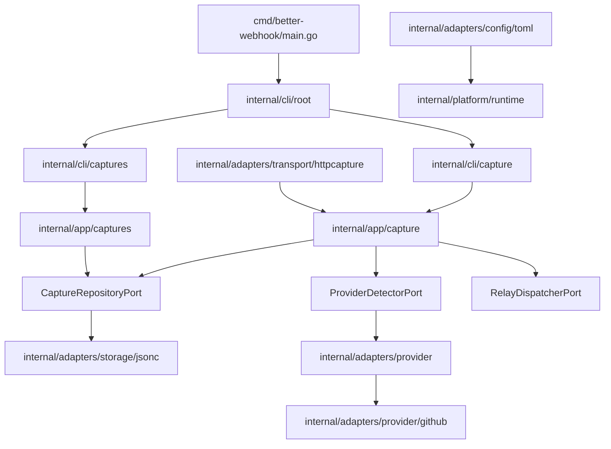

# Better Webhook CLI Go Architecture

This document explains how the Go CLI is organized and how to extend it safely.

It is intended for:

- new developers onboarding to this codebase,
- contributors adding features,
- reviewers validating architecture and boundaries.

## Goals

The architecture optimizes for:

- readability (clear package responsibilities),
- maintainability (small, focused units),
- extensibility (easy to add features/providers/adapters),
- modularity (strict dependency direction).

## High-Level Design

The CLI uses a **Core + Adapters** style:

- **Domain** models and semantic errors are pure and framework-independent.
- **App** services implement use cases through interfaces (ports).
- **Adapters** provide concrete implementations for storage, HTTP transport, provider detection, and config loading.
- **CLI** layer parses arguments and renders output.
- **Platform** layer hosts cross-cutting utilities used by multiple layers.
- **Composition root** wires everything once at startup.

## Package Map

### `cmd/better-webhook`

- Process entrypoint and dependency composition.
- No business logic should live here.

### `internal/domain/capture`

- Core capture types (`CaptureRecord`, `CaptureFile`, header/value types).
- Provider identity and detection result types.
- Semantic errors (`ErrCaptureNotFound`, etc.).
- Must not depend on adapters, CLI, or external frameworks.

### `internal/app/capture`

- Capture ingestion use case.
- Uses ports:
  - repository (`EnsureStorageDir`, `BuildBaseRecord`, `Save`),
  - provider detector (`Detect`),
  - relay dispatcher (`OnCaptureStored`).
- Owns orchestration and transformation logic from request input to domain record.

### `internal/app/captures`

- Read/manage captures use cases (list/filter/resolve/delete).
- Depends on repository ports and domain types.

### `internal/adapters/config/toml`

- TOML loader with environment override support.
- Implements `runtime.Loader`.

### `internal/adapters/storage/jsonc`

- JSONC-backed persistence implementation.
- Handles file naming, atomic writes, list/resolve/delete operations.

### `internal/adapters/provider` and `internal/adapters/provider/github`

- Detector registry and provider-specific detectors.
- Pluggable provider detection chain.

### `internal/adapters/transport/httpcapture`

- HTTP server lifecycle and request/response transport logic.
- Delegates capture business processing to `app/capture.Service`.

### `internal/cli/root`, `internal/cli/capture`, `internal/cli/captures`

- Cobra command definitions.
- Parse flags/args, call app services, format output, map errors for users.

### `internal/platform/runtime`, `internal/platform/logging`, `internal/platform/time`, `internal/platform/id`

- Reusable, cross-cutting helpers.
- Runtime config and argument resolution.
- Logging sanitization.
- Clock and ID abstractions for testability and deterministic behavior.

## Dependency Rules

These rules are mandatory:

1. `internal/domain` imports only stdlib.
2. `internal/app` imports only `internal/domain` and app-local interfaces.
3. `internal/adapters/*` may import `internal/app` and `internal/domain`.
4. `internal/cli/*` may import app services and platform utilities, but must not import adapter packages directly; adapters must be injected as interface implementations by the composition root (`cmd/better-webhook/main.go`).
5. `cmd/better-webhook/main.go` is the only place where concrete adapters are wired to app services.

## Runtime Flow

### CLI bootstrap flow

1. `cmd/better-webhook/main.go` builds dependencies:
   - config loader,
   - storage adapter,
   - provider registry,
   - app services,
   - command tree.
2. Root command runs `runtime.InitializeConfig` during `PersistentPreRunE`.
3. Subcommands resolve runtime args from command context and execute use cases.

### Capture HTTP ingestion flow

1. CLI `capture` command creates app capture service + HTTP server adapter.
2. HTTP adapter receives request body/headers/path.
3. App service:
   - detects provider,
   - builds capture record,
   - persists via repository,
   - triggers optional relay dispatcher.
4. Adapter returns transport response JSON.

### Captures list/delete flow

1. CLI resolves `captures-dir`/flags from runtime config.
2. App captures service calls repository operations.
3. CLI formats output and maps domain/app errors to user-facing messages.

## Configuration Model

Config precedence is:

1. command flags,
2. environment variables,
3. TOML file,
4. defaults.

This is enforced across:

- runtime parsing and path expansion in `internal/platform/runtime`,
- TOML and env loading in `internal/adapters/config/toml`.

## Error Handling Conventions

- **Domain errors** are semantic and reusable.
- **Adapter errors** wrap technical context (`fmt.Errorf(...: %w)`).
- **CLI errors** are translated into user-friendly command messages.
- Avoid leaking low-level file system or parser internals directly to end users.

## Testing Strategy

Tests are organized by layer:

- **App tests**: use mocks/stubs for ports; verify business logic.
- **Adapter tests**: verify concrete behavior (JSONC persistence, HTTP transport, TOML loading, provider detectors).
- **CLI integration tests**: verify command wiring, argument handling, output messages, and error mapping.
- **E2E tests**: verify binary behavior end-to-end.

When adding features, follow the same layering for tests.

## How To Add A New Feature

Example: adding `captures show`.

1. Add domain model updates only if core semantics change.
2. Add use case in `internal/app/captures` (service + any new port methods).
3. Extend storage adapter in `internal/adapters/storage/jsonc` to satisfy new port behavior.
4. Add CLI command in `internal/cli/captures`.
5. Wire the command in `internal/cli/captures/command.go`.
6. Add tests at app, adapter, and CLI layers.
7. Keep main wiring unchanged unless new concrete dependencies are needed.

## How To Add A New Provider Detector

1. Implement detector in `internal/adapters/provider/<provider>/detector.go`.
2. Ensure it returns `DetectionResult` with meaningful confidence.
3. Register it in composition root (`cmd/better-webhook/main.go`) via provider registry.
4. Add detector unit tests.

## Contributor Guardrails

Do:

- keep packages small and purpose-specific,
- inject dependencies through constructors/factories,
- prefer interfaces in app packages (where use cases are defined),
- keep command packages thin.

Do not:

- put storage/network logic in CLI command handlers,
- import adapters into domain,
- bypass app services from transport/CLI layers for business logic,
- add shared `utils` grab-bag packages.

## Decision Checklist For New Code

Before adding a file, ask:

1. Is this core business concept? -> `internal/domain`.
2. Is this use-case orchestration? -> `internal/app`.
3. Is this framework or IO implementation? -> `internal/adapters`.
4. Is this command parsing/output concern? -> `internal/cli`.
5. Is this cross-cutting helper reused by multiple packages? -> `internal/platform`.

If a change crosses more than one layer, validate dependency direction before merging.
